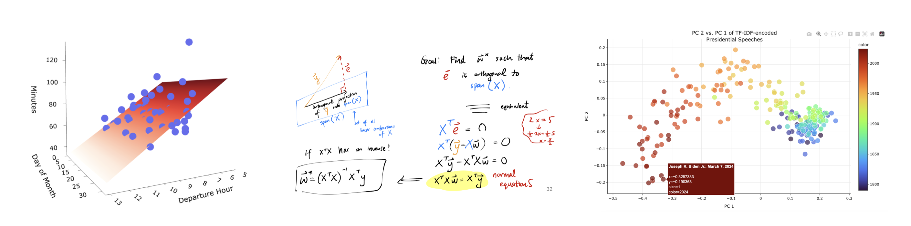

# Mathematics for Machine Learning 🧠
{: .no_toc }
{: .mb-2 }
EECS 298, Fall 2025 at the <b>University of Michigan</b>
{: .no_toc }
{: .fs-6 .fw-300 .mb-2 }

<!-- <small>*Sections 005 and 006</small> -->

4 credits • Open to all majors

<!-- {: .green }
Linear algebra forms the basis of modern machine learning and artificial intelligence. _Mathematics for Machine Learning_ will introduce students to the theory of linear algebra while exposing them to its applications to real-world machine learning problems using Python. After taking this course, students will understand the mathematical underpinnings of linear regression, neural networks, gradient descent, decision trees, dimensionality reduction, and other core ideas in machine learning. -->

<!-- 1. TOC
{:toc} -->

<!-- ## Content -->

{: .green }
Linear algebra, calculus, and probability form the basis of modern machine learning and artificial intelligence. **This course will introduce linear algebra from scratch, by focusing on methods and examples from machine learning.** It will focus on giving students strong intuition for how linear algebra, calculus and probability are used in machine learning. While the course is primarily theoretical, we'll look at practical applications involving real data in Python each week, so that students are able to apply what they've learned.

## Content

Each topic below corresponds to ~1-2 lectures.

- Python, Jupyter Notebooks, and `numpy`.
- Introduction to supervised learning: parameters, loss functions, and empirical risk minimization.
- Optimization in single and multiple variables.
- Vectors, the dot product, and projections.
- Vector spaces and spans.
- Matrices, linear independence, and rank.
- Multiple linear regression, using both projections and vector calculus.
- Partial derivatives and gradient vectors.
- Gradient descent.
- Eigenvalues and eigenvectors.
- Singular value decomposition (SVD) and Principal Components Analysis (PCA).
- The PageRank algorithm.
- Random variables.
- Independence and conditional independence.
- Maximum likelihood estimation.

## Format

- **Lectures (TuTh 3-4:30PM, 1013 DOW)**: Introduce core content in an interactive format. Recorded, and attendance will **not** be taken.
- **Labs (W 12:30-2:30PM or W 4:30-6:30PM)**: Provide supervised practice with mathematical ideas and a venue for exploring practical applications in Python. Attendance **will** be taken.
- **Homeworks**: Assigned and due weekly. Will consist of ~80% math on paper and ~20% code in Python.
- **Exams**: 1-2 Midterm Exams and one Final Exam, all in-person and on-paper.

## FAQs

**Who is teaching the class?**


{{ staffer }}


Since this information is not on ATLAS, course evaluations from Suraj's Fall 2024 offering of a different course can be found [here](https://practicaldsc.org/assets/marketing/fa24-evals.pdf).

**What are the prerequisites?**

- EECS 203 or Math 116 (or Math 215, 216, 275, 285, or 295).
- Some 100-level programming class (e.g. EECS 183, ENGR 101, ROB 102, or similar).

If you're not sure if you meet the prerequisites, email the instructor.

**Who should take this class?**

Anyone who:
- Hasn't already taken a linear algebra course (if you've already taken Math 214, 217, 417, or 419, this course is not for you).
- Plans on taking Upper-Level CS courses about machine learning and artificial intelligence (e.g. EECS 445, DATASCI 415) **and/or** wants to gain exposure to machine learning and Python early in their academic careers.

**What makes this different from other linear algebra courses?**

This course aims to provide:
- Enough rigor to ensure students can succeed in more theoretical ULCS courses (like EECS 445).
- Enough context, motivation, and applications for students to see _why_ linear algebra is useful in machine learning, throughout the entire course.

**Is this class the same as EECS 398: Practical Data Science?**

No, this class is completely separate from EECS 398: Practical Data Science. EECS 298: Mathematics for Machine Learning focuses on the theoretical foundations of machine learning, while EECS 398: Practical Data Science took a more practical approach. EECS 398: Practical Data Science won't be offered in Fall 2025, but we hope to offer it again in the future.